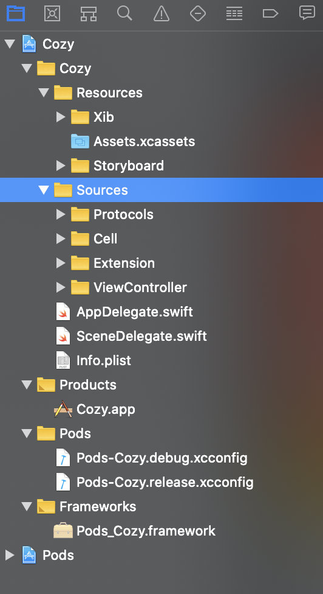

<h1 align="center"> Cozy_iOS 📗 </h1>

  
  
  
  
     

  바쁜 도심 속 휴식처, 공간과 경험을 파는 세상의 모든 독립서점 🌱

 

## ✌️ Coding Convention
- 변수 , 함수명 low camel case 사용
- 변수값 숫자로 그냥 사용하지 않고, cellWidth = 400 처럼 사용 !
- Struct, Class Upper camel case 사용
- 메소드 동사 형태로, 축약어 금지 ex) tUpBtn(🙅🏻  🙅🏻‍♀️) touchUpMainButton( 🙆🏻 🙆🏻‍♂️)
- 강제 옵셔널 금지
- 각자 분담한 스토리보드 외에 건들기 금지
- 커밋시 반드시 서로에게 알릴것

 

## 📁 Foldering

  

## 👩‍👩‍👦‍👦 Contributor

- 
- [황인준](https://github.com/iJoom)
- [최은지](https://github.com/ChoiEunji0114)
- [양재욱](https://github.com/didwodnr123)
- [양지영](https://github.com/yangg0228)
